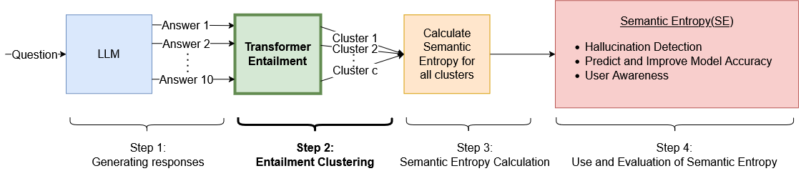

# Detecting Hallucinations

This repository is part of my thesis, titled **"Investigating Hallucinations in AI Text Generation Using Semantic Tools"**, where is presented  a refined framework for detecting hallucinations in language models.

## Project Description

The project focuses on enhancing the framework for hallucination detection by introducing modifications in the entailment step. Specifically, we replace the Entailment LLM with a fine-tuned Transformer model for Natural Language Inference (NLI). This adjustment aims to improve the accuracy and reliability of hallucination detection in language models.



## Installation and Usage
 We recommend using a virtual environment, like Conda, to install the necessary packages.
 We use **Python 3.12.5** and **Pytorch 12.4**.

1. Clone the repository:

   ```bash
   git clone https://github.com/tassos37000/dah.git
   cd dah
   ```
   
2. Install Pytorch following the instructions from the official [website](https://pytorch.org/get-started/locally/).

3. Install the required Python packages:

   ```bash
   pip install -r requirements.txt
   ```

4. Open and execute the notebook:

   ```bash
   jupyter notebook
   ```

To use the code, simply run the [notebook](detect_hallucinations.ipynb).

## License

This project is licensed under the [GPL v3 License](LICENSE).